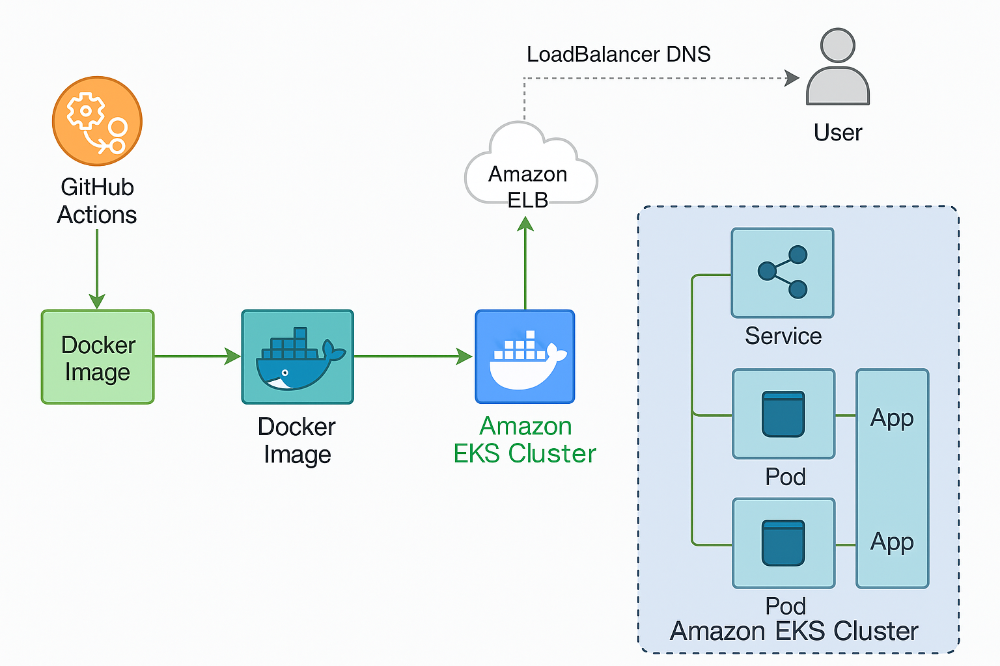
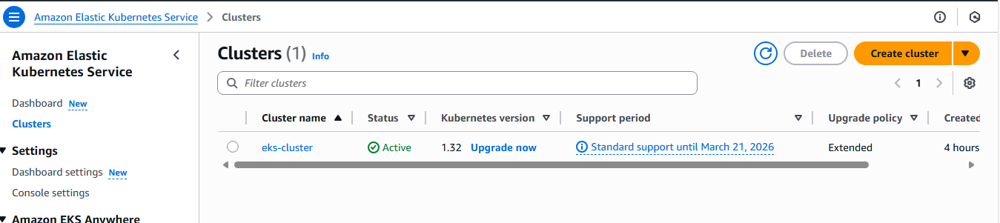

# Node.js App Deployment on AWS EKS

## Project Overview

This project showcases the deployment of a simple cloud-native Node.js application, containerized with Docker, and deployed on AWS Elastic Kubernetes Service (EKS). The deployment process is automated using GitHub Actions for CI/CD.

  <!-- Replace with your image path -->

## What I Did

1. **Application Development**:
   - Developed a simple Node.js application with essential features.
   - Managed dependencies using `package.json` and `package-lock.json`.

2. **Containerization**:
   - Created a Dockerfile to containerize the Node.js application.
   - Built and tested the Docker image locally.

3. **Container Registry Setup**:
   - Pushed the Docker image to **Docker Hub** for public access.
   - Configured AWS **Elastic Container Registry (ECR)** for private access to Docker images.
   - Authenticated Docker to ECR and pushed the image to the registry.

4. **Kubernetes Configuration**:
   - Developed Kubernetes manifests for deployment, service, and other necessary resources.
   
5. **AWS EKS Setup**:
   - Set up an Amazon EKS cluster using eksctl.
   - Configured `kubectl` to interact with the EKS cluster.

     

6. **Deployment**:
   - Applied Kubernetes manifests to deploy the application on EKS.

7. **CI/CD Automation**:
   - Configured GitHub Actions workflows to automate the build and deployment processes.
   - Set up triggers for actions on code changes in the repository.

## Technologies Used

- **Node.js**: Application runtime.
- **Docker**: Containerization of the application.
- **Docker Hub**: Public container registry for sharing images.
- **AWS ECR**: Private container registry for storing Docker images.
- **Kubernetes**: Orchestration of containerized applications.
- **AWS EKS**: Managed Kubernetes service.
- **AWS LoadBalancer between two Incstances**: implemented a loadbalancer Service on aws to acces the application.
- **GitHub Actions**: CI/CD automation.
## Check The application using this link:
You can access the live application here:  
👉 [(http://ab9d10e388cba4c4e8774aa8c70a1dd7-1027063042.eu-north-1.elb.amazonaws.com/api)]
